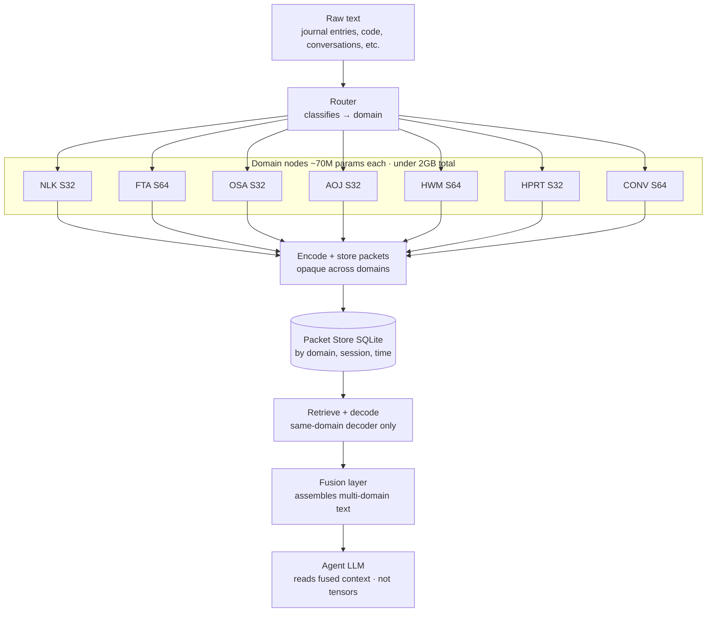

# Diagram 01: NDN System Overview

## Title
Neural Domain Network — System Architecture

## Purpose
Show the complete NDN system from raw text input through compression, storage, retrieval, and reconstruction to the agent LLM reading fused context. This is the "big picture" diagram.

## Diagram

## Key Insight
The NDN sits between the raw world (text artifacts) and the agent LLM, providing compressed, domain-native memory. The agent LLM never sees latent tensors — it reads reconstructed text.

## Layout

> **Note:** The Layout below describes the system conceptually from top (agent) to bottom (input). The Mermaid diagram above uses `graph TB` and flows top-to-bottom from raw text input down to the agent LLM — the visual order is inverted relative to this description.

### Top layer: Agent LLM
- Single large box: "Agent LLM (GPT / Claude / Qwen / etc.)"
- Reads fused context from below

### Middle layer: Fusion
- Box: "Fusion Layer"
- Inputs: reconstructed text from multiple domains (labeled sections)
- Output: single fused context block → up to Agent LLM
- Label: "Assembles multi-domain reconstructed text into agent context"

### Domain layer: Nodes
- Multiple parallel boxes, one per domain:
  - "NLK Node (S32)" — 70M params
  - "FTA Node (S64)" — 70M params
  - "OSA Node (S32)" — 70M params
  - "CONV Node (S64)" — 70M params
  - (etc.)
- Each box has two arrows:
  - Downward: "encode()" — compress text → latent
  - Upward: "decode()" — latent → reconstructed text

### Storage layer: Packet Store
- Box: "Packet Store (SQLite)"
- Contains: "Packets indexed by domain, session, timestamp"
- Arrows from each domain node down to store (encode/store)
- Arrows from store up to each domain node (retrieve/decode)

### Bottom layer: Router
- Box: "Router"
- Input: raw text from below
- Output: classified text directed to appropriate domain node
- Label: "Classifies incoming text → domain"

### Input: Raw text
- Arrow from outside: "Raw text (journal entries, code, conversations, etc.)"

## Arrows
- Raw text → Router (classify)
- Router → Domain Nodes (route to correct node)
- Domain Nodes → Packet Store (encode + store)
- Packet Store → Domain Nodes (retrieve + decode)
- Domain Nodes → Fusion Layer (reconstructed text per domain)
- Fusion Layer → Agent LLM (fused context)

## Key Labels
- "~70M params per node"
- "Total: <2GB for all nodes"
- "Packets are opaque across domains"
- "Agent LLM reads text, not tensors"
