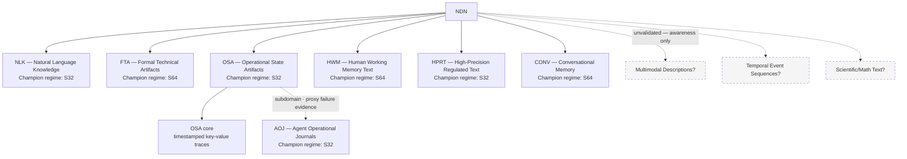

# Diagram 02: Domain Taxonomy Tree

## Title
NDN Domain and Subdomain Taxonomy

## Purpose
Show the hierarchical structure of domains and subdomains. Communicate that the taxonomy is evidence-based, with each branch justified by documented proxy failure.

## Diagram



> **Note:** AOJ shares the same semantic domain as OSA but has a different surface format — this relationship is modeled as a subdomain branch, not a bidirectional edge.

## Key Insight
The tree grows from the top (broadest categories) downward (specialized subdomains). Each branch exists because existing nodes failed on a specific text type.

## Layout

### Root node
- "NDN" (center top)

### Level 1: Top-level domains (6 branches)
```
NDN
├── NLK (Natural Language Knowledge) — S32 champion
├── FTA (Formal Technical Artifacts) — S64 champion
├── OSA (Operational State Artifacts) — S32 champion
│   └── [subdomain branch]
├── HWM (Human Working Memory Text) — S64 champion
├── HPRT (High-Precision Regulated Text) — S32 champion
└── CONV (Conversational Memory) — S64 champion
```

### Level 2: Subdomains (under OSA)
```
OSA
├── OSA core (timestamped key-value traces)
└── AOJ (Agent Operational Journals) — S32 champion
    ├── v1 (54% fact recovery) — superseded
    ├── v2 (73% fact recovery) — superseded
    ├── v3 (66% fact recovery) — failed, regression
    └── v4 (99% fact recovery, 1.78x) — FROZEN CHAMPION
```

### Annotations per domain
- Regime badge: "S32" or "S64"
- Maturity indicator: "HIGH", "MED-HIGH", "MED"
- Champion checkpoint name

### Visual indicators
- Solid lines for validated branches
- Dashed lines for the subdomain connection (OSA → AOJ) with annotation: "justified by proxy failure: OSA-S32 → 14% fact recovery on journals"
- Greyed-out / dotted boxes for "possible future domains" (not validated):
  - "Multimodal Descriptions?"
  - "Temporal Event Sequences?"
  - "Scientific/Math Text?"
  - Label: "Unvalidated — listed for awareness only"

## Key Labels
- "Each branch justified by evidence"
- "Subdomains require documented proxy failure"
- "Greyed branches are hypothetical — no evidence yet"
- AOJ note: "same semantic domain as OSA, different surface format" (see note above the Key Insight section)
