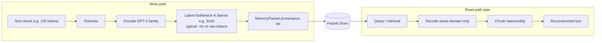

# Diagram 03: Packet Flow

## Title
Memory Packet Lifecycle — Compress → Store → Retrieve → Reconstruct

## Purpose
Show the lifecycle of a single memory packet from creation to use. Emphasize that packets are opaque outside their domain and that provenance is preserved throughout.

## Diagram

## Key Insight
A packet is born in one domain node and can only be decoded by that same node. The packet carries its own provenance, making every piece of reconstructed text traceable.

## Layout — Left to right flow

> **Note:** The following describes the full detailed pipeline. The Mermaid diagram above is a simplified visualization.

### Stage 1: Raw text arrives
- Box: "Raw text" (e.g., a journal entry)
- Arrow right to Router

### Stage 2: Router classifies
- Box: "Router"
- Output: domain label + confidence score
- Arrow right to the selected domain node
- Small annotation: "confidence: 0.92, domain: AOJ"

### Stage 3: Chunking
- Box: "Chunker"
- Input: full text
- Output: chunks (e.g., 3 chunks of 128 tokens each)
- Annotation: "stride=96 for overlapping chunks"

### Stage 4: Encoding
- Box: "AOJ-S32 Encoder"
- Input: chunk (128 tokens)
- Output: latent tensor [32, D]
- Arrow down to packet assembly

### Stage 5: Packet assembly
- Box: "MemoryPacket"
- Fields shown:
  - domain: "AOJ"
  - latent: [32, D]
  - source_tokens: 128
  - timestamp: 2026-04-09T...
  - session_id: "session_42"
  - compression: 4.0x  # latent ratio (128 tokens → 32 latents); end-to-end varies by domain (e.g., AOJ v2: 1.69x)
  - quality_est: 0.85
  - chunk_index: 1 of 3
  - checkpoint: "aoj_s32_v2"

### Stage 6: Storage
- Box: "Packet Store"
- Packet written to store, indexed
- Arrow to storage symbol (database icon)

### [Time passes — dashed line break]

### Stage 7: Retrieval
- Box: "Retrieval Layer"
- Query: "What did we find on corp-alpha?"
- Selects relevant packets from store
- Arrow from store up to retrieval

### Stage 8: Decoding
- Box: "AOJ-S32 Decoder"
- Input: latent tensor [32, D]
- Output: reconstructed text (128 tokens)
- Annotation: "Only AOJ-S32 can decode this packet"

### Stage 9: Post-processing
- Box: "Chunk reassembly"
- Multiple decoded chunks assembled into coherent text
- Overlap regions resolved (take first stride tokens from each chunk)

### Stage 10: Output
- Box: "Reconstructed text"
- Ready for fusion into agent context

## Key Labels
- "Packets are opaque outside their domain"
- "Provenance preserved at every stage"
- "Only the originating node can decode"
- "Cross-domain decoding produces garbage"
