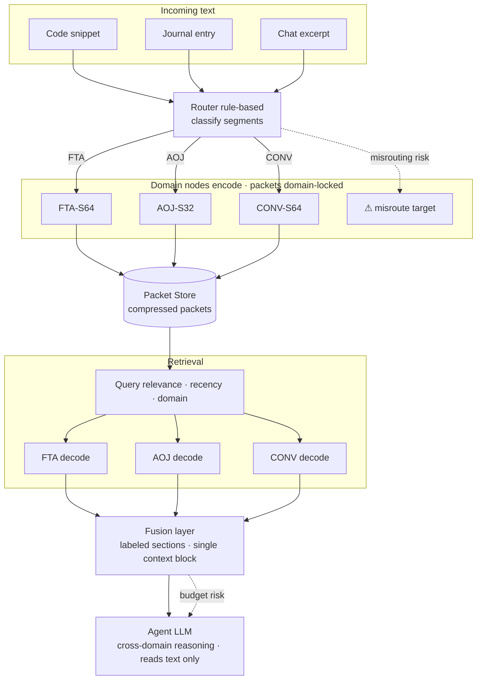

# Diagram 04: Routing and Fusion

## Title
Multi-Domain Routing and Context Fusion

## Purpose
Show how text from multiple domains is routed, compressed, retrieved, and fused into a single context block for the agent LLM. Emphasize that domains never merge — the agent LLM is the integrator.

## Diagram



## Key Insight
Each domain contributes a labeled section to the fused context. The agent LLM reads all sections as text and performs cross-domain reasoning. The NDN does not reason.

## Layout

### Left side: Incoming text (multiple types)

Three incoming text examples:
- "Code snippet" → arrow to Router
- "Journal entry" → arrow to Router
- "Chat excerpt" → arrow to Router

### Center: Router
- Box: "Router"
- Three outgoing arrows, each labeled with domain:
  - Code snippet → "FTA" → FTA Node
  - Journal entry → "AOJ" → AOJ Node
  - Chat excerpt → "CONV" → CONV Node

### Middle: Domain Nodes (parallel)
Three node boxes side by side:
- "FTA-S64 Node" — encode → packet
- "AOJ-S32 Node" — encode → packet
- "CONV-S64 Node" — encode → packet

Each produces packets that go to storage.

### [Retrieval phase — dashed line]

### Retrieval
- Box: "Retrieval Layer"
- Agent needs memory → queries by domain/recency/relevance
- Selects packets from each relevant domain

### Domain decoding (parallel)
Three decode operations:
- FTA packets → FTA Node decode → reconstructed code text
- AOJ packets → AOJ Node decode → reconstructed journal text
- CONV packets → CONV Node decode → reconstructed conversation text

### Fusion Layer
- Box: "Fusion Layer"
- Inputs: three reconstructed text blocks with domain labels
- Output: single fused context:

```
[MEMORY — FTA]
def process_targets(hosts):
    ...reconstructed code...

[MEMORY — AOJ]
## Phase 1A: Subdomain Collection — COMPLETED
- subfinder: 555 hosts (corp-alpha)...

[MEMORY — CONV]
User: Can you check the corp-alpha results?
Assistant: I found 169 live hosts...
```

### Top: Agent LLM
- Box: "Agent LLM"
- Reads fused context as text
- Performs cross-domain reasoning
- Label: "The LLM is the integrator — NDN does not reason"

## Failure mode annotations
- Red annotation at Router: "Misrouting → domain-prior projection"
- Red annotation at Fusion: "Bad budget allocation → important memory truncated"
- Red annotation between domains: "No cross-domain decoding — packets are domain-locked"

## Key Labels
- "Domains never merge"
- "Each domain section is labeled for provenance"
- "Agent LLM reads text, not tensors"
- "Context budget divided across domains"
