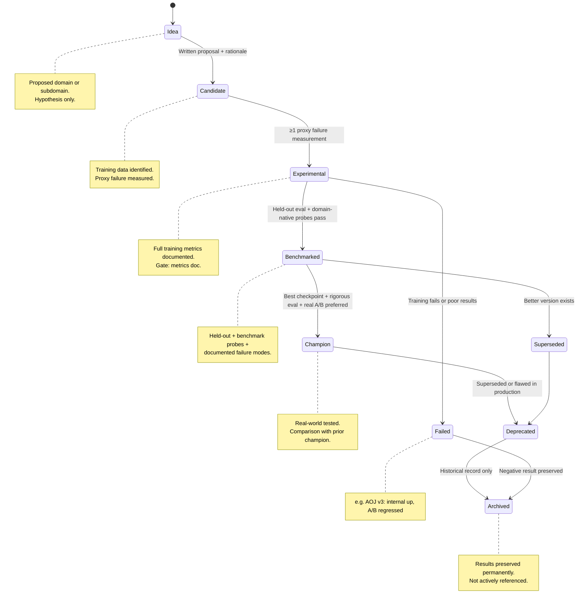

# Diagram 05: Node Lifecycle

## Title
Node Maturity Progression

## Purpose
Show the stages a node passes through from initial idea to champion or deprecation. Emphasize that promotion requires evidence at each stage, and that deprecated/failed nodes remain in the record.

## Diagram

## Key Insight
The lifecycle is a funnel: many ideas, fewer candidates, fewer experiments, fewer benchmarked nodes, very few champions. Failed experiments are documented, not deleted.

## Layout — Vertical flow (top to bottom)

### Stage 1: Idea (top, widest)
- Box: "Idea"
- Description: "Proposed domain or subdomain. Hypothesis only."
- Gate: "Written proposal + rationale"
- Arrow down

### Stage 2: Candidate
- Box: "Candidate"
- Description: "Training data identified. Proxy failure measured."
- Gate: "At least 1 proxy failure measurement"
- Arrow down

### Stage 3: Experimental
- Box: "Experimental"
- Description: "Model trained. Internal eval complete."
- Gate: "Full training metrics documented"
- Two arrows:
  - Down: to Benchmarked (if held-out eval passes)
  - Right: to "Failed" (if training does not converge or results are poor)

### Stage 4: Benchmarked
- Box: "Benchmarked"
- Description: "Held-out eval + domain-native benchmarks complete."
- Gate: "Held-out results + benchmark probes + documented failure modes"
- Two arrows:
  - Down: to Champion (if it is the best checkpoint and survives rigorous eval)
  - Right: to "Superseded" (if a better version exists)

### Stage 5: Champion
- Box: "Champion" (highlighted / bold)
- Description: "Best checkpoint for this domain. Real-world tested."
- Gate: "Real A/B preferred + comparison with prior champion"
- Arrow right: to Deprecated (when superseded or flawed)

### Side path: Deprecated
- Box: "Deprecated"
- Description: "Superseded by better version or found to be flawed."
- Arrow down to Archived

### Side path: Archived
- Box: "Archived"
- Description: "Historical record. Not actively referenced."
- Label: "Results preserved permanently"

### Side path: Failed
- Box: "Failed" (red or grey)
- Description: "Experiment did not produce useful results."
- Label: "Documented as negative result"
- Example annotation: "AOJ v3: internal metrics improved, real A/B regressed"

## Annotations
- At each gate, show the evidence type required:
  - Idea → Candidate: "proxy failure evidence"
  - Candidate → Experimental: "trained checkpoint + metrics"
  - Experimental → Benchmarked: "held-out eval + domain-native probes"
  - Benchmarked → Champion: "real A/B or rigorous held-out + no regressions"
- Failed/deprecated nodes have dashed borders to indicate they are not active

## Key Labels
- "Promotion requires evidence at every stage"
- "Failed experiments are documented, not deleted"
- "Champion ≠ beats markdown. Champion = best NDN checkpoint for this domain"
- "Internal metrics alone never justify promotion past Experimental"
