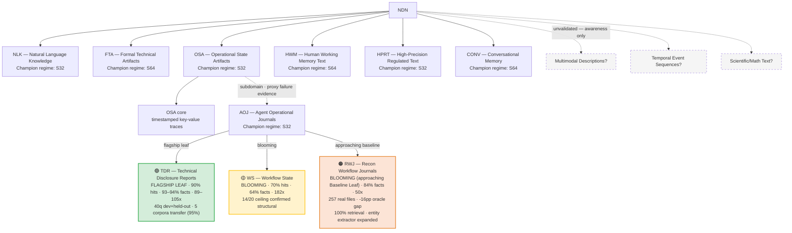

# Diagram 02: Domain Taxonomy Tree

## Title
NDN Domain and Subdomain Taxonomy

## Purpose
Show the hierarchical structure of domains and subdomains. Communicate that the taxonomy is evidence-based, with each branch justified by documented proxy failure.

## Diagram



## Key Insight
The tree grows from the top (broadest categories) downward (specialized subdomains). Each branch exists because existing nodes failed on a specific text type.

## Layout

### Root node
- "NDN" (center top)

### Level 1: Top-level domains (6 branches)
```
NDN
├── NLK (Natural Language Knowledge) — S32 champion
├── FTA (Formal Technical Artifacts) — S64 champion
├── OSA (Operational State Artifacts) — S32 champion
│   └── [subdomain branch]
├── HWM (Human Working Memory Text) — S64 champion
├── HPRT (High-Precision Regulated Text) — S32 champion
└── CONV (Conversational Memory) — S64 champion
```

### Level 2: Subdomains (under OSA)
```
OSA
├── OSA core (timestamped key-value traces)
└── AOJ (Agent Operational Journals) — S32 champion
    ├── v1 (54% fact recovery) — superseded
    ├── v2 (73% fact recovery) — CHAMPION
    └── v3 (66% fact recovery) — failed, regression
```

### Level 3: Leaves (under AOJ)
```
AOJ
├── 🟢 TDR (Technical Disclosure Reports) — FLAGSHIP LEAF
│       Dev: 18/20 (90%) · Held-out: 18/20 (90%) · Combined: 36/40 (90%)
│       94% fact recovery, 89–105x compression
│       Transfers across 5 corpora (114/120 = 95%), zero code changes
│       Champion pipeline: FTS5 → isolated reconstruction → heuristic ranking
│       Failure mode: near-identical titles only
│
├── 🟡 WS (Workflow State) — BLOOMING
│       All variants: 14/20 (70%) ceiling, 64% facts, 182x compression
│       Extended entity extractor (+8 WS patterns), same isolation architecture
│       Ceiling confirmed structural across 3 scoring variants
│       Failure modes: session imbalance, temporal reasoning, sibling overlap
│       Needs: temporal override, session balancing, source-aware retrieval
│
└── 🟠 RWJ (Recon Workflow Journals) — BLOOMING (approaching Baseline Leaf)
        257 real pentesting files (952K tokens), human-authored campaigns
        v1 borrowed pipeline: 14/20 (70%), same ceiling as WS
        v2 doc-type-aware: Dev 20/20, Held-out 13/20 (keyword classifier too narrow)
        v3 embedding classifier: Dev 19/20, Held-out 16/20, Combined 35/40 (88%)
        v3 + entity expansion: 84% facts, 50x compression, -16pp oracle gap
        Retrieval: 40/40 (100%) — pipeline always finds the target
        Entity extractor: +11 RWJ-specific categories (dollars, counts, tools, IDs)
        Remaining gap: E-temporal (67%) and doc-type semantic edge cases
        Needs: pipeline freeze + E-temporal improvement for 🌿 Baseline Leaf
```

### Annotations per domain
- Regime badge: "S32" or "S64"
- Maturity indicator: "HIGH", "MED-HIGH", "MED"
- Champion checkpoint name

### Visual indicators
- Solid lines for validated branches
- Green box (🟢) for flagship leaf nodes (TDR — dev + held-out + multi-corpus transfer, champion frozen)
- Yellow box (🟡) for blooming nodes (WS — benchmarked, structural ceiling identified, specialist engine not yet built)
- Orange box (🟠) for blooming nodes approaching baseline (RWJ — embedding classifier + expanded entity extractor, 84% facts at 50x compression, approaching Baseline Leaf)
- Dashed lines for the subdomain connection (OSA → AOJ) with annotation: "justified by proxy failure: OSA-S32 → 14% fact recovery on journals"
- Greyed-out / dotted boxes for unvalidated candidate domains
  - "Multimodal Descriptions?"
  - "Temporal Event Sequences?"
  - "Scientific/Math Text?"

## Key Labels
- "Each branch justified by evidence"
- "Subdomains require documented proxy failure"
- "Leaves require end-to-end validation (retrieval + reconstruction + held-out)"
- "Greyed branches are hypothetical — no evidence yet"

## Cross-Leaf Findings
- **14/20 (70%) ceiling** confirmed on both WS and RWJ using the shared/borrowed pipeline — this is the boundary where generic heuristic ranking stops working on multi-document-per-target data
- **100% retrieval** confirmed across 40 RWJ queries — the pipeline finds the right neighborhood every time; the problem is always ranking, never retrieval
- **Each leaf has a distinct failure mode**: TDR = near-identical titles, WS = session imbalance + temporal reasoning, RWJ = document-type disambiguation + temporal reasoning within sessions
- **Leaf-specific engineering is the path**: doc-type-aware retrieval broke RWJ from 70% to 88%, entity extractor expansion raised facts from 59% to 84%. WS likely needs temporal-override logic. The tree structure justifies itself by revealing different problems at each leaf
- **Entity extractor expansion is a repeatable intervention**: WS gained +31pp (35%→66.6%), RWJ gained +25pp (59%→84%). The entity layer is NDN's primary "tuning knob" — same model, same pipeline, different patterns per leaf
