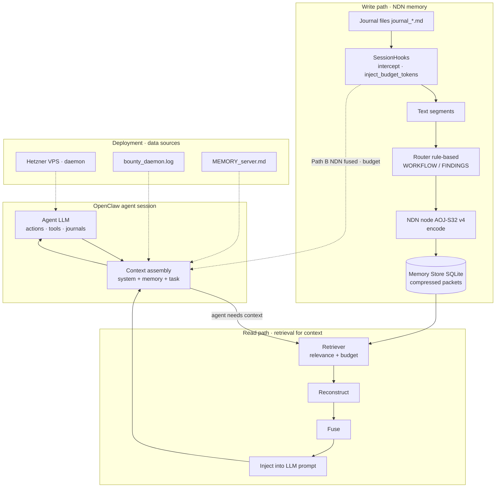

# Diagram 06: OpenClaw Agent Integration

## Title
NDN Integration with OpenClaw Bug-Bounty Agent

## Purpose
Show a concrete example of NDN integrated into a real agent workflow. This is the only integration tested so far. The diagram shows the actual components used and the data flow during the A/B test.

## Diagram



## Key Insight
The NDN sits in the agent's memory layer, between session history and the agent LLM. The agent's behavior is identical whether it reads markdown or NDN-reconstructed text — only the memory source differs.

## Layout

### Top: Agent LLM
- Box: "OpenClaw Agent (LLM)"
- Receives: system prompt + memory context + current task
- Produces: actions (scan commands, tool calls, journal updates)

### Memory injection point
- Box: "Context Assembly"
- Two paths into this box (the A/B):
  - Path A: "MEMORY.md + raw journals" (markdown baseline)
  - Path B: "NDN fused context" (compressed memory)
- Output: assembled context → Agent LLM

### Path B detail: NDN Memory Layer
```
[SessionHooks]
    ↑ injects memory into agent context
    |
[FusedContext]
    ↑ assembled from multi-domain reconstructions
    |
[Compressor]  ←→  [AOJ-S32 v4 Node]
    ↑               encode() / decode()
    |
[MemoryStore (SQLite)]
    ↑ packets indexed by domain, session, timestamp
    |
[Router]
    ↑ classifies journal text → WORKFLOW or FINDINGS
    |
[Journal files]
    journal_vfsglobal.md
    journal_dailymotion.md
    journal_expressvpn.md
    journal_harman.md
    journal_pinelabs.md
```

### Bottom: Data sources
- "Hetzner VPS" → OpenClaw daemon runs here
- "bounty_daemon.log" → timeline and session boundaries
- "MEMORY_server.md" → agent's persistent memory file
- "journal_*.md" → per-target operational journals

### A/B comparison box
- Side-by-side comparison:
  - Side A: "2,626 tokens | 100% facts | 1.0x"
  - Side B (v4): "~1,475 tokens | 99% facts | 1.78x"
  - Verdict: "Near-parity. v4 closes the gap (99% vs 100%). Prior v2 was 73%."

### Annotations at key components

**Router**:
- "Rule-based classification"
- "All journal text routes to WORKFLOW or FINDINGS"
- "No text routed to CONVERSATION (journals are not dialogue)"

**Compressor**:
- "Loads AOJ-S32 v4 checkpoint"
- "Encodes journal chunks into latent packets"
- "Decodes packets back to text on retrieval"

**SessionHooks**:
- "Intercepts agent context assembly"
- "Injects NDN memory in place of raw journals"
- "Respects inject_budget_tokens limit"

## Key Labels
- "This is the only real-world integration tested"
- "The agent cannot tell whether it is reading markdown or NDN memory"
- "Same agent, same journals, different memory path"
- "v4 reaches near-parity with markdown (99% vs 100%)"
- "NDN provides 1.78x compression"
